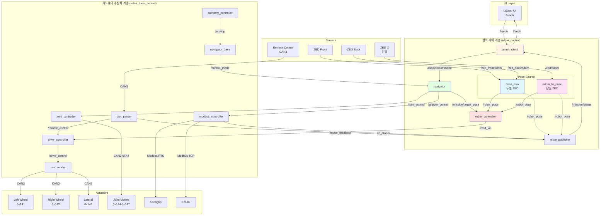
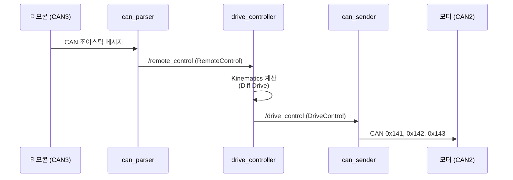
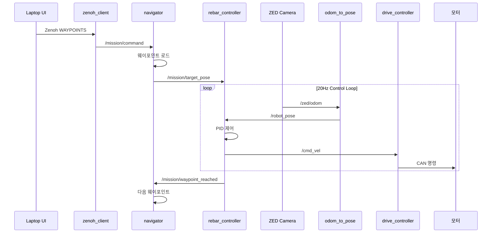
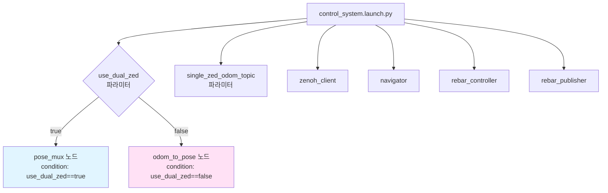
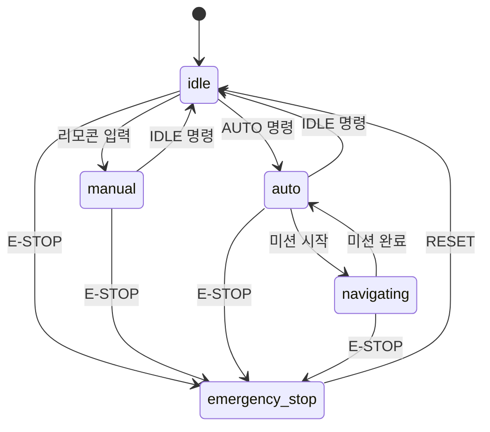
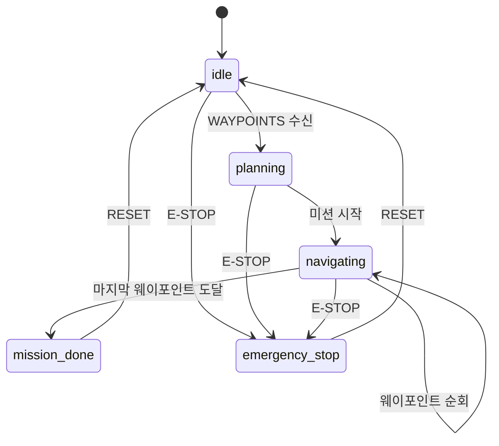

# Rebar 제어 시스템 아키텍처

## 전체 시스템 구조



---

## Pose Source 선택 로직

### 듀얼 ZED 환경 (기본)

```mermaid
graph LR
    ZF[ZED Front<br/>/zed_front/odom]
    ZB[ZED Back<br/>/zed_back/odom]
    CV[/cmd_vel<br/>방향 신호]

    PM[pose_mux]
    OUT[/robot_pose]

    ZF --> PM
    ZB --> PM
    CV --> PM

    PM -->|선택된 Odometry| OUT

    style PM fill:#e1f5ff
```

**선택 기준:**
- `/cmd_vel.linear.x > 0` → Front ZED 사용
- `/cmd_vel.linear.x < 0` → Back ZED 사용
- 정지 시 → Front ZED 우선 (파라미터 설정 가능)

### 단일 ZED 환경

```mermaid
graph LR
    ZED[ZED X<br/>/zed/odom]
    O2P[odom_to_pose]
    OUT[/robot_pose]

    ZED -->|Odometry| O2P
    O2P -->|PoseStamped<br/>변환| OUT

    style O2P fill:#ffe1f5
```

**특징:**
- 단순 메시지 타입 변환 (Odometry → PoseStamped)
- 타임스탬프 유지
- 최소 지연 (< 1ms)

---

## 제어 모드별 데이터 플로우

### Manual 모드 (리모콘 제어)



### Auto 모드 (자동 주행)



---

## 토픽 맵

### 상위 제어 계층 (rebar_control)

| 토픽 | 타입 | 발행자 | 구독자 | 설명 |
|------|------|--------|--------|------|
| `/robot_pose` | PoseStamped | pose_mux 또는 odom_to_pose | rebar_controller, rebar_publisher, zenoh_client | 로봇 현재 위치 |
| `/mission/command` | String | zenoh_client | navigator | UI 명령 (E-STOP, START, WAYPOINTS 등) |
| `/mission/target_pose` | PoseStamped | navigator | rebar_controller | 현재 목표 위치 |
| `/mission/feedback` | String | navigator | rebar_publisher | 미션 진행 상황 |
| `/mission/waypoint_reached` | String | rebar_controller | navigator | 목표 도달 알림 |
| `/mission/status` | String (JSON) | rebar_publisher | zenoh_client | 통합 상태 정보 |
| `/cmd_vel` | Twist | rebar_controller | drive_controller | 속도 명령 |

### 하드웨어 추상화 계층 (rebar_base_control)

| 토픽 | 타입 | 발행자 | 구독자 | 설명 |
|------|------|--------|--------|------|
| `/drive_control` | DriveControl | drive_controller | can_sender | 주행 모터 제어 |
| `/joint_control` | JointControl | (상위) | joint_controller | 관절 모터 제어 |
| `/remote_control` | RemoteControl | can_parser | drive_controller | 리모콘 입력 |
| `/motor_feedback` | MotorFeedback | can_parser | (상위) | 모터 피드백 |
| `/control_mode` | String | navigator_base | navigator | 제어 모드 (manual/auto/emergency) |

---

## Launch 파일 구조

### control_system.launch.py



**실행 예시:**

```bash
# 듀얼 ZED (기본)
ros2 launch rebar_control control_system.launch.py

# 단일 ZED
ros2 launch rebar_control control_system.launch.py use_dual_zed:=false

# 단일 ZED (커스텀 토픽)
ros2 launch rebar_control control_system.launch.py \
  use_dual_zed:=false \
  single_zed_odom_topic:=/custom/zed/odom
```

---

## State Machine 통합

### navigator_base (하드웨어 계층)



### navigator (상위 계층)



---

## 파일 구조

```
rebar_control/
├── rebar_control/
│   ├── zenoh_client.py          # UI 통신
│   ├── navigator.py              # 미션 관리
│   ├── rebar_controller.py       # 경로 추종
│   ├── rebar_publisher.py        # 상태 발행
│   ├── pose_mux.py               # 듀얼 ZED 처리
│   └── odom_to_pose.py          # 단일 ZED 처리 ⭐ NEW
│
├── launch/
│   ├── control_system.launch.py  # 상위 제어 계층 (수정됨)
│   └── full_system.launch.py     # 전체 시스템 (TODO)
│
├── config/
│   └── zenoh_config.yaml
│
├── docs/
│   ├── ODOM_TO_POSE_NODE.md     # odom_to_pose 문서 ⭐ NEW
│   └── ARCHITECTURE_DIAGRAM.md   # 아키텍처 다이어그램 ⭐ NEW
│
└── setup.py                      # odom_to_pose entry_point 추가됨
```

---

## 다음 단계

### Phase 3 완료를 위한 작업

1. **full_system.launch.py 작성**
   - `base_system.launch.py` include
   - `control_system.launch.py` include
   - 전체 시스템 한 번에 실행

2. **ZED X 실제 연동 테스트**
   - ZED 카메라 실행
   - odom_to_pose 통합 테스트
   - rebar_controller 동작 확인

3. **navigator PAUSE/RESUME 기능**
   - State Machine 확장
   - /mission/command 명령 추가

4. **성능 테스트**
   - 600mm 주행 정확도 측정
   - PID 파라미터 튜닝
   - 응답 지연 측정

---

**작성일**: 2025-12-23
**작성자**: Claude Code (Sonnet 4.5)
